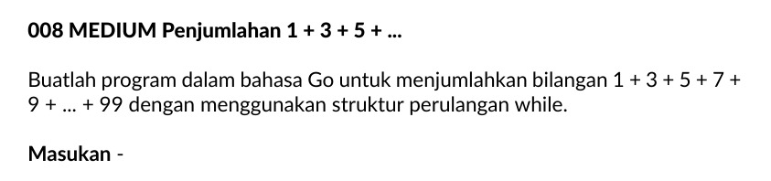

# loop by condition
- while loop: minimal iterasi 0
- repeat until: minimal iterasi 1

# while loop
```
while condition do
    algorithm
end while
```
# repeat until
```
repeat 
    algorithm
until condition
```
# example based

```
program print_halo

kamus

algoritma

    input(salam)
    while salam != "#" do
        output("halo")
        input(salam)
    endwhile
////////////////////////////
algoritma

    input(salam)
    if salam != "#" then
        repeat
            output("halo") 
            input(salam)
        until salam == "#"
    endif

end program
```

# STUDI KASUS

## STUDI KASUS 1

```
algoritma
    input(no,durasi)
    while no != 0 or durasi != 0 do
        total = total + durasi
        input(no,durasi)
    endwhile
    output(total)

algoritma
    repeat
        input(no,durasi)
        total = total + durasi
    until no == 0 and durasi == 0
    output(total)
```
## STUDI KASUS 2


```
algoritma
    x = 1
    while x <= 99 do
        total = total + x
        x = x + 2
    endwhile

```
```golang
algoritma
    
    for x = 1 ; x <= 99 ; x++ {
      total = total + x  
    }
    fmt.Print(total)

```

```
    for x <- 1 to 99  do

    endfor

```

## STUDI KASUS 3 

| Input | Output | 
|---------|----------|
| 2 | **True** | 
| 3 | **True** |
| 14 | **False** |  

```
algoritma
    prima = true
    
    input(x)
    // x = 6
    i = x - 1
    while i >= 2 and prima do
       prima = x mod i != 0
       i = i - 1
    endwhile
    output(prima)

    // 9 mod 9 == 0 true
    9 mod 8 != 0 true
    .......
    9 mod 3 == 0 false
    keluar loop

    4 mod 4 == 0 true
    4 mod 3 != 0 true
    4 mod 2 == 0 false

    // 5 mod 5 == 0  true
    5 mod 4 != 0  true
    5 mod 3 != 0  true
    5 mod 2 != 0  true
    // 5 mod 1 == 0  true

```

```
1 2 3 4 5 6 7 8 9 10 11 12 13 14 15

```

## STUDI KASUS 4
.jpeg>)

```
algoritma
    isKonsekutif = true
    input(bilangan)
    repeat
        digit1 = bilangan mod 10
        digit2 = bilangan div 10 mod 10
        isKonsekutif = digit1 - digit2 == 1 || digit2 - digit1 == 1 
        bilangan = bilangan div 10
    until !(isKonsekutif) or bilangan < 10
    output(isKonsekutif)

notes: bilangan < 10 karena kalo satuan udah ga perlu dicek dan menyelesaikan masalah input 23456789 


|0 - 9| == 1 ngga?
|0 - 1| == -1
1 - 0
 kalo ngga bukan konsekutif

```


## STUDI KASUS 5


