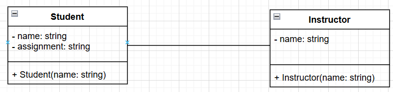
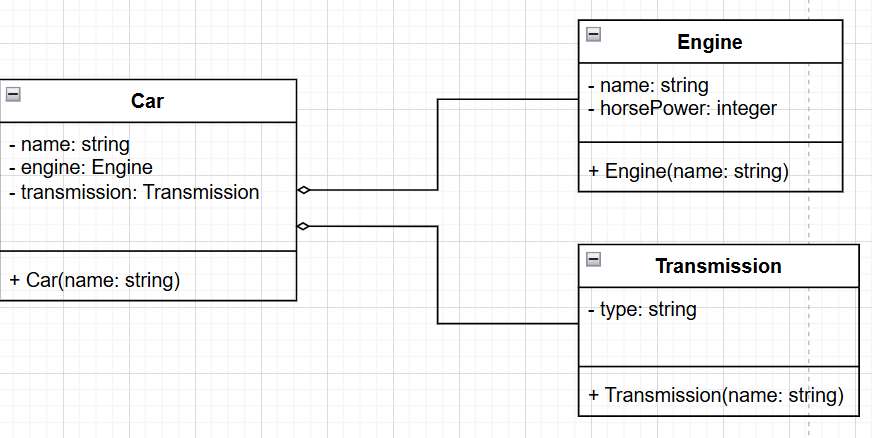
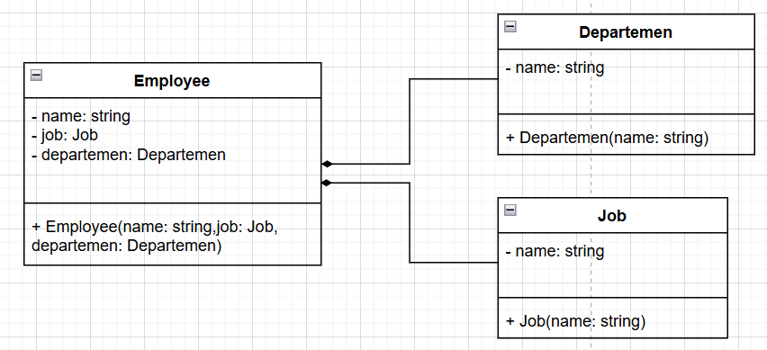
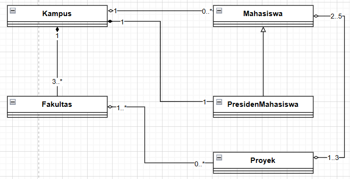

# PBO

## No.1 (Relasi Antar Class)

### Asosiasi

Hubungan general antar kelas tanpa ada "Ownership"



```java

public class Student {
    private String name;
    private String assignment;

    public Student(String name){
        this.name = name;
    }

    public void setName(String name){
        this.name = name;
    }

    public String getName(){
        return name;
    }

    public void setAssignment(String assignment){
        this.assignment = assignment;
    }

    public String getAssignment(){
        return assignment;
    }
}

public class Instructor {
    private String name;

    public Instructor(String name){
        this.name = name;
    }

    public void giveAssignment(Student s, String assignment){
        s.setAssignment(assignment);
    }
}

public class Association {

    public static void main(String[] args) {
        Student std = new Student(("Dedi"));
        Instructor inst = new Instructor("Enjang");

        inst.giveAssignment(std, "Object Oriented Programming");
        System.out.println(std.getName() + " assigned " + std.getAssignment());
        //System.out.println("Hello World!");
    }
}
```

### Agregasi

Hubungan Has-A antar kelas dengan "Week-Ownership"



```java
public class Car {
    private String name;
    private Engine engine;
    private Transmission transmission;

    public Car(String name){
        this.name = name;
    }

    public String getCarName() {
        return this.name;
    }

    public void addEngine(Engine e){
        engine = e;
    }

    public void addTransmission(Transmission t){
        transmission = t;
    }
}

public class Engine {
    private String name;
    private int horsePower;

    public Engine(String name) {
        this.name = name;
    }

    public String getEngineName() {
        return name;
    }

    public int getHorsePower() {
        return horsePower;
    }

    public void setHorsePower(int hp) {
        this.horsePower = hp;
    }
}

public class Transmission {
    private String type;

    public String getType() {
        return type;
    }

    public void setType(String type) {
        this.type = type;
    }
}

public class Aggregation {

    public static void main(String[] args) {
        Car honda = new Car("Honda S2000");

        Engine v1000 = new Engine("v1000");

        Transmission auto = new Transmission();
        auto.setType("Automatic");

        honda.addEngine(v1000);
        honda.addTransmission(auto);

        System.out.println(honda.getCarName() + " has a " + v1000.getEngineName() + " engine and " + auto.getType() + " transmission");

    }
}
```

### Komposisi

Hubungan Owns-A antar kelas dengan "Strong-Ownership"



```java
public class Employee {
    private String name;
    private Job job;
    private Department department;

    public Employee(String employeeName, String jobName, double jobSalary, String departmentName) {
        this.name = employeeName;
        this.job = new Job(jobName, jobSalary);
        this.department = new Department(departmentName);
    }

    public String getEmployeeName() {
        return name;
    }

    public double getSalary() {
        return job.getJobSalary();
    }

    public String getJob() {
        return job.getJobName();
    }

    public String getDepartment() {
        return department.getDepartmentName();
    }
}

public class Department {
    private String name;

    public Department(String departmentName) {
        this.name = departmentName;
    }

    public String getDepartmentName() {
        return name;
    }
}

public class Job {
    private String name;
    private double salary;

    public Job(String jobName, double jobSalary) {
        this.name = jobName;
        this.salary = jobSalary;
    }

    public String getJobName() {
        return name;
    }

    public double getJobSalary() {
        return salary;
    }
}

public class Composition {

    public static void main(String[] args) {
        Employee emp = new Employee("Lucas", "Analyst", 100000000, "Business Development");
        System.out.println(emp.getEmployeeName() + " work as a " + emp.getJob() + " on " + emp.getDepartment() + " department and has a salary worth " + emp.getSalary());
    }
}
```

## No.2 (Class Diagram)

- Kampus memiliki banyak Mahasiswa
- Mahasiswa hanya bisa menjadi bagian dari 1 kampus saja
- Kampus terdiri dari 3 atau lebih fakultas
- Tiap Kampus menunjuk 1 presiden mahasiswa, yang adalah seorang
  Mahasiswa
- Tiap Fakultas mendapatkan banyak Proyek
- Tiap Fakultas memiliki banyak Mahasiswa yang mengerjakan Proyek
- Tiap Mahasiswa dapat mengerjakan 1 hingga 3 Proyek
- Tiap Proyek dapat dikerjakan 2 sampai 5 Mahasiswa


